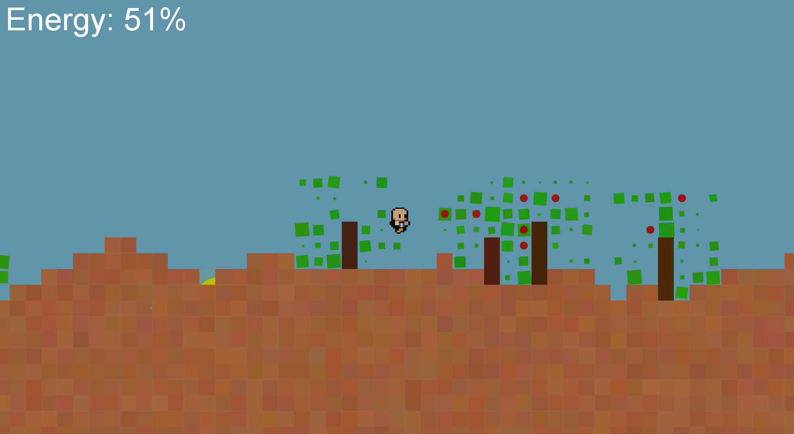

# PEPSE
Precise Environmental Procedural Simulator Extraordinaire

A 2D side-scrolling simulation built with DanoGameLab featuring procedural terrain generation, day/night cycle, avatar with energy system, and trees with fruits.

## How to Run
- Java 17 required
- This project depends on the **DanoGameLab** library, which is not included in this repository (external course library). Download it separately and place `DanoGameLab.jar` inside a `libs/DanoGameLab/` folder at the project root.
- Open in IntelliJ
- Add `libs/DanoGameLab/DanoGameLab.jar` as a project dependency (library)
- Run `PepseGameManager`

## Design

### Avatar
- **State Pattern** — `IdleState`, `RunState`, `JumpState` each handle their own logic
- **Energy** — encapsulated in a dedicated `Energy` class
- **EnergyDisplay** — receives a `Supplier<Float>` callback, decoupled from `Avatar`
- Double jump implemented inside `JumpState`

### Trees
- `Flora` receives a `groundHeightAt` callback instead of depending on `Terrain` directly
- Leaves use `Transition` + `ScheduledTask` with random delay for natural wind animation
- Fruits disappear on collision and reappear after 30 seconds

### Infinite World
- `InfiniteWorldManager` manages the world in chunks using a `Map`
- Distant chunks are removed to save memory
- `Objects.hash(x, seed)` ensures consistent world generation across sessions
